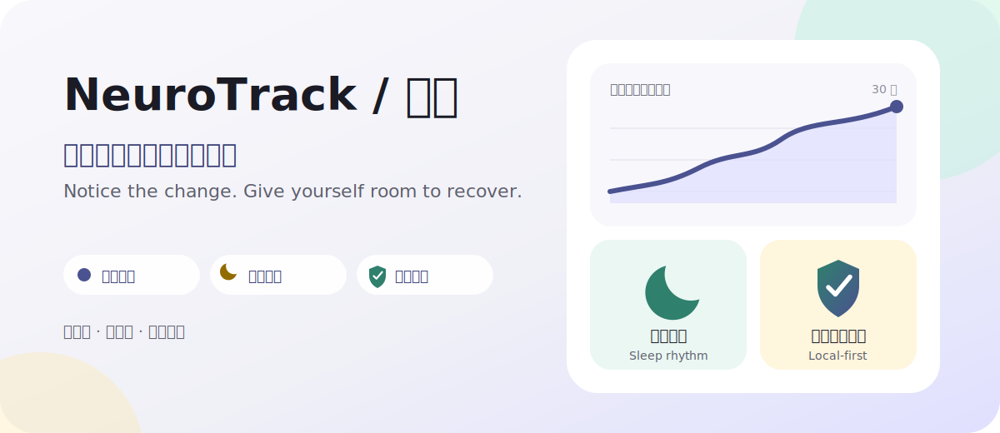
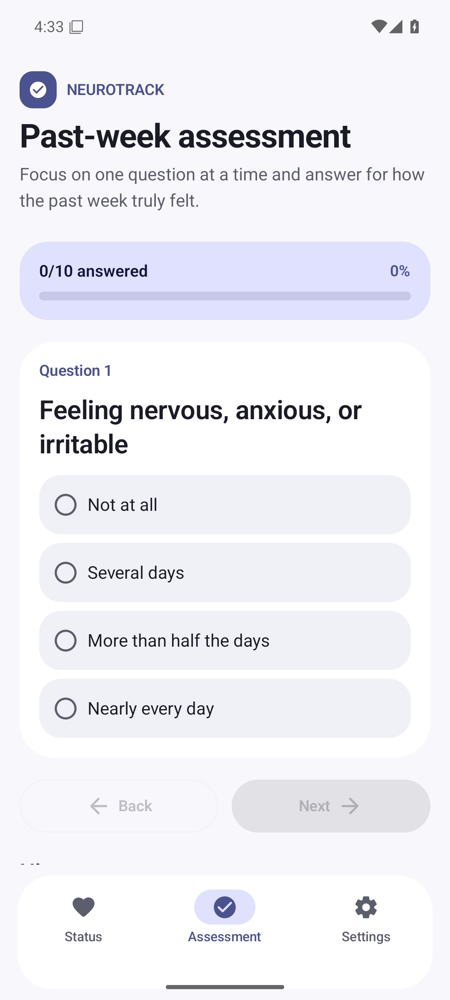
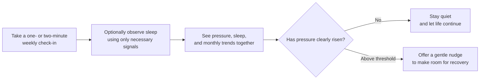

# NeuroTrack

<div align="center">
  
  <p><strong>Notice the change. Give yourself room to recover.</strong></p>
  <p>A quiet, local-first Android app I built to help me notice pressure and sleep changes during recovery.</p>
  <p><a href="README.zh-CN.md">简体中文</a></p>
  <p>
    <a href="https://github.com/howyoungchen/NeuroTrack/releases/latest"></a>
    
    
  </p>
</div>



<div align="center">
  <strong><a href="https://github.com/howyoungchen/NeuroTrack/releases/latest">Download the latest release</a></strong>
  ·
  <a href="https://github.com/howyoungchen/NeuroTrack/releases">View all releases</a>
</div>

## Real app screens

These are real NeuroTrack v1.4 screens captured from an Android emulator with fictional assessment data. They are not design mockups and contain no personal information.

<table>
  <tr>
    <td width="33%"></td>
    <td width="33%"></td>
    <td width="33%"></td>
  </tr>
  <tr>
    <td align="center"><strong>Status at a glance</strong><br><sub>Pressure, sleep, and trends together</sub></td>
    <td align="center"><strong>One question at a time</strong><br><sub>A focused past-week check-in</sub></td>
    <td align="center"><strong>Settings and permissions</strong><br><sub>Every local-data permission stays visible</sub></td>
  </tr>
</table>

## Why I built it

If you have lived through anxiety or something similar, you may know the uneasy part that comes after the worst is over: feeling better does not always mean feeling safe from sliding back.

For me, a difficult period rarely arrives without warning. The signs tend to show up earlier — several poor nights of sleep, unexplained tension, rumination returning, or the rhythm of ordinary life slowly coming apart. The trouble is that these signals are hardest to notice while I am inside them. By the time I can name what is happening, the pressure may have been building for a while.

I wanted a tool that could hold onto those small changes for me:

- check in on how the past week actually felt;
- put subjective experience and sleep changes in the same picture;
- speak up only when the pattern is genuinely worth my attention.

I could not find one that felt right, so I built NeuroTrack.

One principle has guided the whole project: **the app itself must never become another source of pressure.** It does not demand a daily streak, hold me to a score, or use anxiety to pull me back in. It should stay quietly on my phone and offer a little evidence when I need to understand my state.

## It may be useful to you if

- You are past the most difficult stage but still want to notice changes earlier.
- You often realize pressure has accumulated only after several bad nights or a clear drop in energy.
- You want to see longer-term patterns without maintaining a complicated daily journal.
- You do not want sensitive assessment, sleep, or wellbeing data tied to a cloud account.
- You want reminders to be restrained instead of relentless.

NeuroTrack will not decide whether you are relapsing, and it will not tell you what treatment you need. Its purpose is simpler: **to put changes that are easy to miss somewhere you can see them.**

## What it helps me observe

| What I want to know | What NeuroTrack does |
| --- | --- |
| How has the past week felt? | A 10-question weekly check-in that usually takes a minute or two |
| Is pressure accumulating? | Combines the check-in with available sleep signals into a 0–10 pressure level and a monthly trend |
| Is my routine quietly shifting? | Infers sleep duration, bedtime, and wake time from screen-interaction timestamps, then shows weekly and monthly rhythm |
| When should it get my attention? | Sends an alert only above pressure level 5; if no check-in exists for 7 days, it can remind me at most once on the weekly schedule I choose |
| Can I take my data with me? | Lets me manually export logs and raw sleep data for a time range I select |

The app supports English and Chinese, plus system, light, and dark themes.

## What using it looks like



1. Install the app and complete your first check-in under **Assessment**.
2. If you want sleep observation, grant Usage Access in **Settings**. Location is an optional supporting signal.
3. Open **Status** to see pressure level, recent sleep, and longer-term trends.
4. Then go live your life. The app can speak when something deserves attention.

This is not something I want to “maintain” every day. The less effort it takes, the more likely it is to remain genuinely useful.

## What I deliberately left out

- **No account system:** no phone number, email address, or sign-in.
- **No network feature:** the manifest does not request internet access, and the app does not send records to a server.
- **No streak mechanics:** no points, rankings, daily streaks, or guilt-driven copy.
- **No medical conclusions:** the score is for self-observation, not diagnosis or professional decision-making.
- **No default access to everything:** sleep observation and location assistance remain under your control.

## Privacy and permissions

This information is sensitive, so I designed NeuroTrack to be local-first:

- Assessments, sleep records, screen events, and runtime logs are stored in the on-device database.
- Sleep observation uses system-provided screen-interaction timestamps. It does not read screen content, messages, or content from other apps.
- Optional coarse location uses existing on-device movement signals only to help estimate wake-time boundaries. NeuroTrack does not store raw location tracks.
- NeuroTrack itself does not upload records. The only in-app path for sharing selected data is a deliberate export through Android's system share sheet; Android system backups still follow your device settings.
- The app requests no internet permission and includes no analytics, advertising SDK, or cloud account.

Android may ask for these permissions:

| Permission | Why it is used | Required? |
| --- | --- | --- |
| Notifications | Weekly check-in reminders and elevated-pressure alerts | Optional |
| Usage Access | Queries screen-interaction times to infer sleep state over the past 24 hours | Needed for sleep observation |
| Approximate location | Uses a local movement signal to help estimate wake-time boundaries; no raw track is stored | Optional |
| Boot completed | Restores local scheduled work after a phone restart | Used automatically |
| Battery optimization exemption / exact alarms | Improves the reliability of background analysis and reminder timing | Optional |

## Download and install

1. Open the [latest Release](https://github.com/howyoungchen/NeuroTrack/releases/latest) and download the <code>.apk</code>.
2. If Android asks, allow your browser or file manager to install unknown apps.
3. Open the APK to install NeuroTrack.

NeuroTrack supports Android 8.0 (API 26) and above. APKs on GitHub Releases are signed with the project's release key; use packages from the same Releases page when upgrading.

## One important note

NeuroTrack is a tool I use to observe changes in myself. **It is not medical software and it cannot replace a doctor, therapist, or emergency support.**

If your symptoms are severe, keep getting worse, or include thoughts of harming yourself, please do not wait for an app to alert you. Contact a professional, someone you trust, or your local emergency service. Taking care of yourself matters more than completing any record.

## Build from source

You will need Android Studio 2025.3+ and JDK 17+ (AGP 9.2.1, Min SDK 26 / Target SDK 36):

```powershell
.\gradlew.bat assembleDebug
```

Before opening a PR, please run:

```powershell
.\gradlew.bat :app:compileDebugKotlin
.\gradlew.bat :app:lintDebug
.\gradlew.bat :app:testDebugUnitTest
```

## Thank you — and come join us

Thank you to everyone who has used the app, shared an experience, suggested an improvement, or simply read this far.

If you care about recovery, privacy-friendly tools, or Android development, you are welcome here. You can [open an issue](https://github.com/howyoungchen/NeuroTrack/issues), improve the wording, refine sleep inference, add tests, or help with translation.

I have one request: this project is for people doing the difficult work of recovery. Please be kind, avoid stigmatizing language, and treat anything that sounds like medical advice with care.

## License

This project is released under the [NeuroTrack Noncommercial License](LICENSE).

Personal use, learning, research, modification, and noncommercial distribution are permitted. Commercial use requires prior written authorization.
