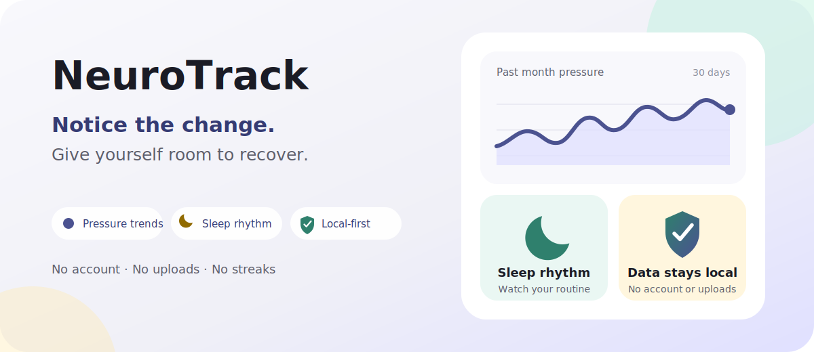
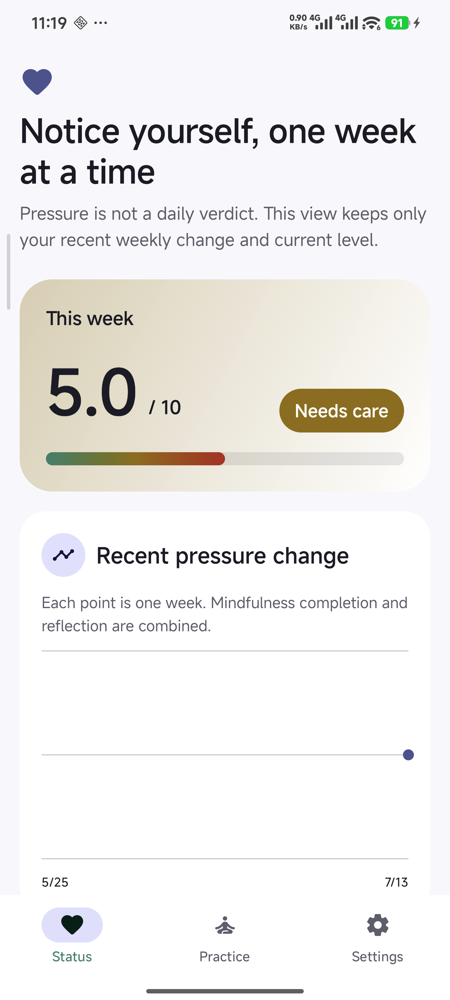
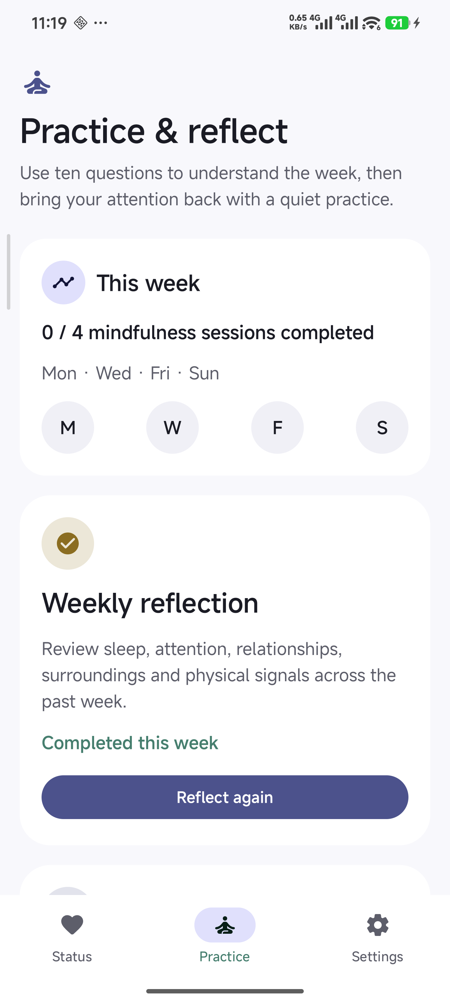
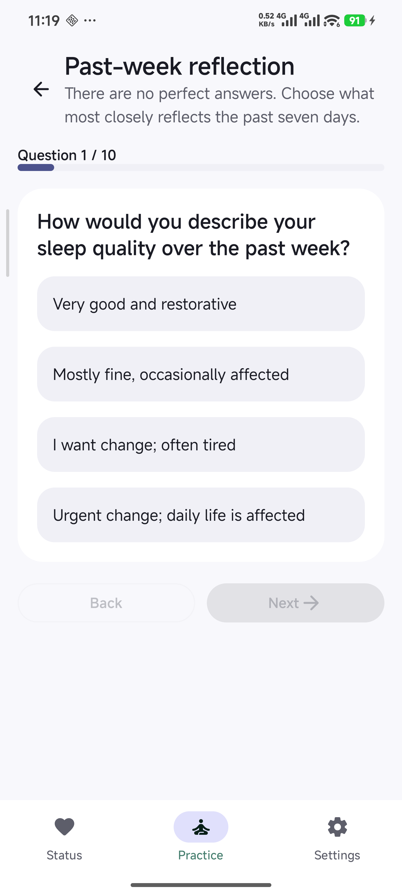
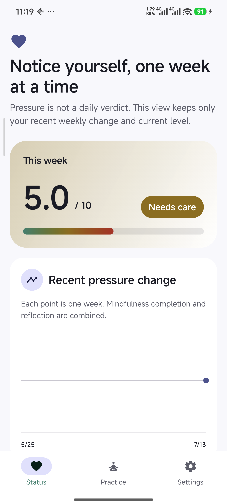
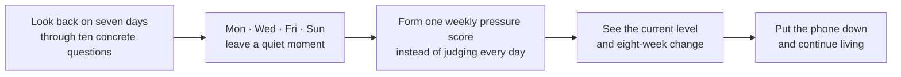

# NeuroTrack

<div align="center">
  
  <p><strong>Notice the week. Leave yourself a little quiet.</strong></p>
  <p>A small Android app I wrote for myself: one honest look back each week, and a few moments when the phone stays down.</p>
  <p><a href="README.zh-CN.md">简体中文</a></p>
  <p>
    <a href="https://github.com/howyoungchen/NeuroTrack/releases/latest"></a>
    
    
  </p>
</div>



<div align="center">
  <strong><a href="https://github.com/howyoungchen/NeuroTrack/releases/latest">Download the latest release</a></strong>
  ·
  <a href="https://github.com/howyoungchen/NeuroTrack/releases">View all releases</a>
</div>

## What it looks like now

These are real v2.0 development screens from an Android 16 phone. The weekly pressure value comes from answers entered specifically for the screenshots; it is not my health record.

<table>
  <tr>
    <td width="25%"></td>
    <td width="25%"></td>
    <td width="25%"></td>
    <td width="25%"></td>
  </tr>
  <tr>
    <td align="center"><strong>This week, not today</strong><br><sub>No verdict from one difficult day</sub></td>
    <td align="center"><strong>Practice and reflect</strong><br><sub>Four quiet moments each week</sub></td>
    <td align="center"><strong>Ten concrete questions</strong><br><sub>Daily life instead of abstract labels</sub></td>
    <td align="center"><strong>Restrained settings</strong><br><sub>Only what the app genuinely needs</sub></td>
  </tr>
</table>

## Why I rebuilt it

I first wrote NeuroTrack because I wanted to notice pressure changing before it became overwhelming. After anxiety or something similar, the hardest stage can pass while the fear of sliding backwards stays around.

Over time, I learned that watching a daily score did not make me feel safer. A late night or a bad hour could move the number. The more often I checked, the easier it was to mistake an ordinary fluctuation for a warning sign.

Many wellbeing apps also lean on streaks, points, and bright reminders. Those ideas may help someone else. For me, they turned “taking care of myself” into one more task I was not supposed to miss.

So I rebuilt NeuroTrack. It no longer judges each day or quietly gathers extra signals. It asks only two questions: **How did this week actually go? Did I truly stop for a while?**

One rule has stayed with me from the beginning: **the app itself must not become another source of pressure.**

## The rhythm I wanted

On Monday, Wednesday, Friday, and Sunday, I set aside 5, 10, or 15 minutes. Mindfulness pins the screen, asks me to leave the phone alone, and plays gentle sound generated on the device.

Once a week, I look back through ten questions. They do not vaguely ask whether I feel anxious. They ask about sleep, phone switching, disagreement, work, relationships, surroundings, physical signals, and rest.

Those answers and the week's completed practices form one weekly pressure score. Status keeps only the current bar and an eight-week trend. The details do not need to sit in front of me every day.



## Who it may be useful for

You may find it useful if you:

- want to notice change over time without writing a daily journal;
- often realize pressure has accumulated only after fatigue or irritability becomes obvious;
- want mindfulness to be time away from the phone, not just an audio player;
- dislike streaks, points, rankings, and reminders designed to create guilt;
- do not want private reflections attached to a cloud account.

NeuroTrack does not decide whether you are ill or relapsing, and it does not tell you how to treat anything. It simply gives the easily missed parts of a week one place to be seen together.

## What it does today

| What I want to know | How NeuroTrack responds |
| --- | --- |
| What was the past week actually like? | A ten-question reflection grounded in ordinary life |
| Is pressure slowly accumulating? | One 0–10 weekly score combining reflection and mindfulness completion |
| Did I really stop for a while? | Planned practice on Monday, Wednesday, Friday, and Sunday, recorded as completed or interrupted |
| Will I reach for another app during practice? | The screen is pinned; leaving, unpinning, or switching apps interrupts the session |
| Do I need to keep watching it? | Status shows only this week and the recent eight-week change |
| Where does the data go? | Reflections and practice records stay on the device with cloud backup disabled |

The app supports English and Chinese, plus system, light, and dark themes.

## What I deliberately left out

- **No account system:** no phone number, email address, or sign-in.
- **No network feature:** no Internet permission, advertising, or analytics SDK.
- **No daily pressure score:** one difficult day does not deserve to become a verdict.
- **No streak mechanics:** no points, rankings, or guilt over a broken streak.
- **No sleep inference:** sleep appears only as a subjective weekly question; no screen events or location are read.
- **No medical conclusions:** the score supports reflection, not diagnosis.

## Privacy and permissions

This information is private, so NeuroTrack tries to know less and say less.

- Weekly reflections, mindfulness records, and settings stay in the on-device Room database and preferences.
- The app requests no Internet permission, uploads nothing, and disables system cloud backup.
- It does not read app usage, location, screen content, messages, or anything inside another app.
- Mindfulness sound is generated locally in real time; no audio download is needed.
- On Android 13 and above, the only permission prompt is for practice-day notifications.

| Permission or system capability | Why it is used | User approval |
| --- | --- | --- |
| Notifications | One reminder at your chosen time on practice days | Optional |
| Boot completed | Restore the local reminder schedule after a restart | Handled by Android |
| Screen pinning | Reduce app switching during mindfulness; unpinning interrupts the session | Confirmed by Android when practice starts |

## Download and install

1. Open the [latest Release](https://github.com/howyoungchen/NeuroTrack/releases/latest) and download the <code>.apk</code>.
2. If Android asks, allow your browser or file manager to install unknown apps.
3. Open the APK to install NeuroTrack.

NeuroTrack supports Android 8.0 (API 26) and above. Release APKs use the project's release key; keep using packages from the same Releases page when upgrading.

## One important note

I wrote NeuroTrack as one more way to notice and care for myself. **It is not medical software and it cannot replace a doctor, therapist, or emergency support.**

If symptoms are severe, keep getting worse, or include thoughts of self-harm, do not wait for an app to produce a score. Contact a professional, someone you trust, or your local emergency service.

## Build from source

You will need Android Studio 2025.3+ and JDK 17+ (AGP 9.2, Min SDK 26 / Target SDK 36):

```powershell
.\gradlew.bat assembleDebug
```

Before opening a PR, run:

```powershell
.\gradlew.bat :app:compileDebugKotlin
.\gradlew.bat :app:lintDebug
.\gradlew.bat :app:testDebugUnitTest
```

## Thank you — and come join us

Thanks for reading this far, and thanks to everyone who has tried the app, shared an experience, or taken the time to report a problem.

If recovery, self-observation, mindfulness, or privacy-friendly tools matter to you, you are welcome to [open an issue](https://github.com/howyoungchen/NeuroTrack/issues), improve the wording, add tests, or help with translation.

I have one request: this project is for people doing the difficult work of living. Please be kind, avoid stigmatizing language, and treat anything that sounds like medical advice with care.

## License

This project is released under the [NeuroTrack Noncommercial License](LICENSE).

Personal use, learning, research, modification, and noncommercial distribution are permitted. Commercial use requires prior written authorization.
