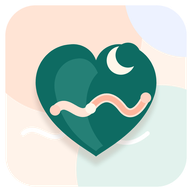
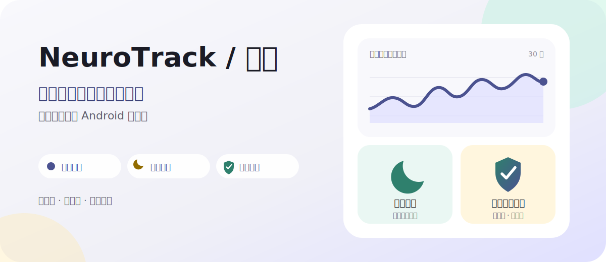
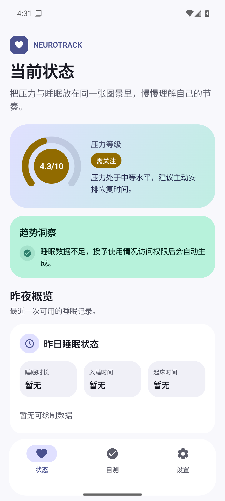
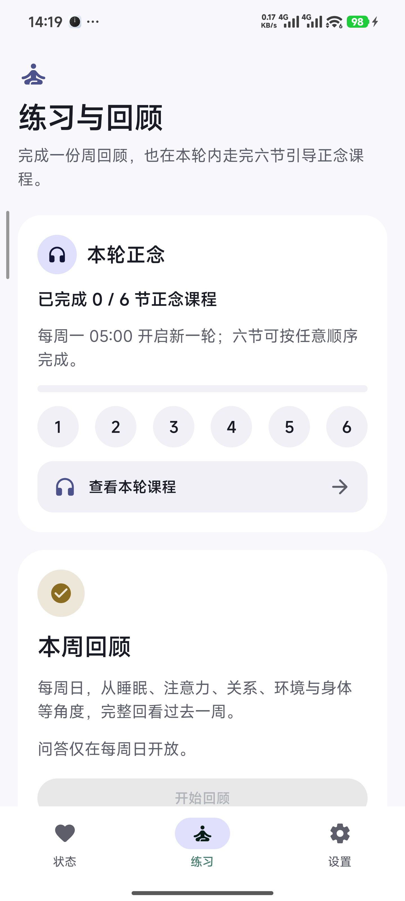
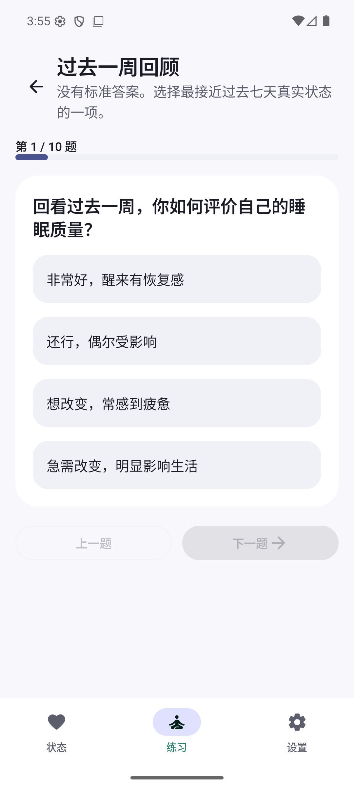
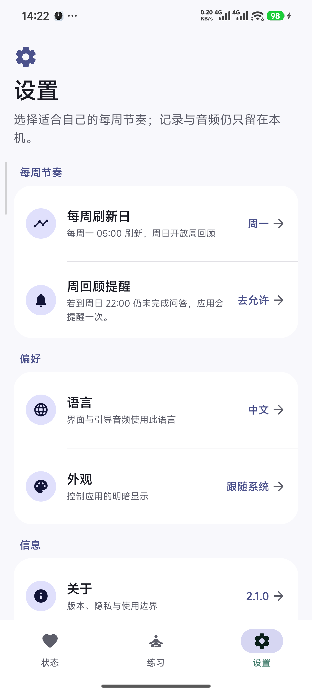
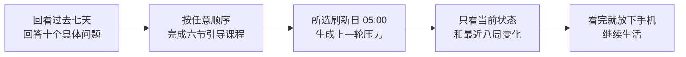

# NeuroTrack / 心迹

<div align="center">
  
  <p><strong>看见这一周，也给自己一点安静。</strong></p>
  <p>这是我给自己写的 Android 小工具：每周回头看一次，也认真留几段时间给自己。</p>
  <p><a href="README.md">English</a></p>
  <p>
    <a href="https://github.com/howyoungchen/NeuroTrack/releases/latest"></a>
    
    
  </p>
</div>



<div align="center">
  <strong><a href="https://github.com/howyoungchen/NeuroTrack/releases/latest">下载最新版本</a></strong>
  ·
  <a href="https://github.com/howyoungchen/NeuroTrack/releases">查看全部版本</a>
</div>

## 现在跑起来是什么样

下面是当前开发版在 Android 16 上的实际界面。截图中的内容仅用于展示，不是我的健康记录。

<table>
  <tr>
    <td width="25%"></td>
    <td width="25%"></td>
    <td width="25%"></td>
    <td width="25%"></td>
  </tr>
  <tr>
    <td align="center"><strong>上周的状态</strong><br><sub>一周结束后再形成结论</sub></td>
    <td align="center"><strong>本轮正念</strong><br><sub>进度与六节课程收进同一入口</sub></td>
    <td align="center"><strong>十个具体问题</strong><br><sub>回看真实生活，不做抽象打分</sub></td>
    <td align="center"><strong>分组设置</strong><br><sub>主页只显示当前值，需要时再展开</sub></td>
  </tr>
</table>

## 我为什么重新做了它

最初写 NeuroTrack，是因为我想早点看见压力的变化。经历过焦虑或类似的神经症以后，那种“是不是又要往下掉”的担心，并不会在最难熬的阶段过去后马上消失。

可我慢慢发现，按天盯着分数并没有让我更安心。今天睡得晚一点、此刻心情差一点，数字就跟着动。看得越勤，反而越容易把正常波动当成问题。

很多健康 App 还喜欢连续打卡、积分和醒目的提醒。它们可能有用，但对我来说，那会把“照顾自己”变成另一项不能落下的任务。

所以我把 NeuroTrack 重新做了一遍。现在它不再分析每天，也不再偷偷收集更多信号。它只问两个问题：**这一周过得怎么样？我有没有真正停下来几次？**

我仍然守着最开始的那条原则：**这个 App 本身不能成为新的压力来源。**

## 我想要的是这样的节奏

每一轮包含六节引导正念：感官觉察、正念呼吸、身体扫描、溪流上的树叶、慈爱与自我关怀，以及与困难情绪共处。六节可以按任意顺序完成。播放时屏幕会固定；离开应用会中断本节，而不会悄悄算作完成。

练习页把进度与六节课程统一收在“本轮正念”里：主页安静地显示本轮完成情况，点“查看本轮课程”后，再在底部抽屉中选择课程、阅读说明并开始练习。

每周再做一次回顾。十个问题不会泛泛地问“你焦虑吗”，而是问睡眠感受、手机切换、不同观点、工作状态、关系、环境、身体信号和休息。

每周刷新日可以在设置中选择，默认为周一。到刷新日 05:00，本轮结束，上一轮的回答和六节课程完成情况会合成一个周压力分数，同时开启新一轮。问答仅在刷新日的前一天开放；如果当天 22:00 仍未完成，应用提醒一次。



## 它可能适合谁

你可能会用得上它，如果你：

- 想观察一段时间的变化，但不想每天写日记；
- 常常等到明显疲惫或烦躁后，才发现压力已经攒了一阵子；
- 希望正念不只是一个音频播放器，而是一段真的不会碰手机的时间；
- 不喜欢连续打卡、积分、排名和带着愧疚感的提醒；
- 不想把这些很私人的记录交给云端账号。

它不会判断你是否生病或复发，也不会告诉你该怎么治疗。它只是帮我把一周里容易忽略的东西放到一起，留一个可以回头看的位置。

## 现在能做什么

| 我关心的事 | NeuroTrack 怎么回应 |
| --- | --- |
| 过去一周到底怎么样 | 用 10 个贴近日常的问题，完成一次周回顾 |
| 压力是不是在慢慢积累 | 把周回顾与正念完成情况合成 0–10 的周压力 |
| 我有没有真的停下来 | “本轮正念”集中显示进度与六节课程，并分别记录完成或中断 |
| 练习时会不会又拿起手机 | 固定当前屏幕；离开、退出固定或切换 App 都算中断 |
| 我需不需要一直盯着它 | 状态页只显示最近结束的一周和最近八周趋势 |
| 数据会去哪里 | 周回顾与练习记录只保存在本机，不做云备份 |

支持中文与 English，也支持跟随系统、浅色和深色主题。设置主页只显示当前值；刷新日、语言和外观在统一的底部选择面板中调整。

## 我刻意没有做的事

- **没有账号系统**：不需要手机号、邮箱或登录。
- **没有联网功能**：不申请互联网权限，也没有广告或分析 SDK。
- **没有每日压力分**：一天的起伏不值得变成一个结论。
- **没有连续打卡**：没有积分、排行榜，也不拿“断签”制造愧疚。
- **没有睡眠推断**：睡眠只是周回顾里的主观感受，不读取屏幕事件或位置。
- **没有医疗结论**：分数用于自我观察，不代表诊断。

## 隐私与权限

这些东西很私人，所以 NeuroTrack 尽量少知道，也尽量少开口。

- 周回顾、正念记录和设置保存在手机本地的 Room 数据库与偏好设置中。
- App 不申请互联网权限，不上传记录，也不启用系统云备份。
- App 不读取使用情况、位置、屏幕内容、消息或其他应用里的任何内容。
- 英文与普通话引导音频随 APK 保存在本机，并随应用语言选择；播放不需要联网。
- Android 13 及以上只会询问通知权限，用于问答开放日未完成时的一次提醒。

| 权限或系统能力 | 用途 | 是否需要用户授权 |
| --- | --- | --- |
| 通知 | 仅在问答开放日 22:00 且周问答未完成时提醒一次 | 可选 |
| 开机完成 | 手机重启后恢复本地提醒计划 | 系统自动处理 |
| 屏幕固定 | 正念时减少切换应用；退出固定会中断练习 | 开始练习时由系统确认 |

## 下载与安装

1. 前往 [Releases](https://github.com/howyoungchen/NeuroTrack/releases/latest) 下载最新的 <code>.apk</code>。
2. 如果 Android 提示，请允许浏览器或文件管理器“安装未知应用”。
3. 打开 APK 完成安装。

NeuroTrack 支持 Android 8.0（API 26）及以上版本。Release APK 使用项目发布密钥签名；升级时请继续使用同一 Releases 页面提供的安装包。

## 一个重要的提醒

我写 NeuroTrack，是为了多一个观察和照顾自己的工具。**它不是医疗软件，也替代不了医生、心理咨询师或紧急援助。**

如果症状很严重、一直在恶化，或者你有伤害自己的想法，别等 App 给出一个分数。请尽快联系专业人士、你信任的人或当地紧急救助服务。

## 从源码构建

需要 Android Studio 2025.3+、JDK 17+（AGP 9.2，Min SDK 26 / Target SDK 36）：

```powershell
.\gradlew.bat assembleDebug
```

提 PR 前请运行：

```powershell
.\gradlew.bat :app:compileDebugKotlin
.\gradlew.bat :app:lintDebug
.\gradlew.bat :app:testDebugUnitTest
```

## 谢谢你，也欢迎你

能读到这里就谢谢你。也谢谢每一个用过 App、分享过感受或者认真提出问题的人。

特别感谢 **NSW Multicultural Health Communication Service（NSW Health）**制作并公开 Multicultural Mindfulness Resources。NeuroTrack 收录了官方[英文版](https://www.mhcs.health.nsw.gov.au/campaigns-and-projects/current-campaigns/mindfulness-program-audio-resources/english)与[普通话版](https://www.mhcs.health.nsw.gov.au/campaigns-and-projects/current-campaigns/mindfulness-program-audio-resources/mandarin)中的六节练习原始音频。

这些音频的版权仍归 NSW Multicultural Health Communication Service 所有，使用与再分发需遵守来源网站的[版权与再使用条件](https://www.mhcs.health.nsw.gov.au/about-us/copyright-and-disclaimer)。项目保持音频原样，不将其纳入 NeuroTrack 源代码许可。

如果你也在意恢复、自我观察、正念或隐私友好的工具，欢迎[提交问题或建议](https://github.com/howyoungchen/NeuroTrack/issues)，也欢迎改文案、补测试或完善翻译。

我只有一个请求：这个项目关乎正在努力生活的人。请保持善意，避免污名化表达，也请谨慎对待任何听起来像医疗建议的说法。

## 开源协议

NeuroTrack 代码与项目原创资源使用 [NeuroTrack Noncommercial License](LICENSE)。随包提供的 NSW MHCS 音频保留上文及[第三方声明](THIRD_PARTY_NOTICES.md)所述的独立版权与再使用条件。

个人使用、学习、研究、修改与非商业分发均被允许；商业使用需要事先获得书面授权。
