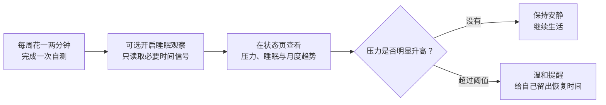

# NeuroTrack / 心迹

<div align="center">
  
  <p><strong>看见变化，早点照顾自己。</strong></p>
  <p>这是我给自己写的一个 Android 小工具，用来看看康复期里的压力和睡眠有没有悄悄变差。</p>
  <p><a href="README.md">English</a></p>
  <p>
    <a href="https://github.com/howyoungchen/NeuroTrack/releases/latest"></a>
    
    
  </p>
</div>


<div align="center">
  <strong><a href="https://github.com/howyoungchen/NeuroTrack/releases/latest">下载最新版本</a></strong>
  ·
  <a href="https://github.com/howyoungchen/NeuroTrack/releases">查看全部版本</a>
</div>

## 实机界面

这就是 v1.4 跑起来的样子。我在模拟器里随手填了一组测试数据，主要让你先看看界面。

<table>
  <tr>
    <td width="33%"></td>
    <td width="33%"></td>
    <td width="33%"></td>
  </tr>
  <tr>
    <td align="center"><strong>状态概览</strong><br><sub>压力、睡眠与趋势放在一起</sub></td>
    <td align="center"><strong>逐题自测</strong><br><sub>一次只关注一个问题</sub></td>
    <td align="center"><strong>设置与权限</strong><br><sub>权限拿来做什么都写清楚</sub></td>
  </tr>
</table>

## 我为什么做它

如果你经历过焦虑症或类似的神经症，你大概知道：最难熬的那阵子过去了，不代表从此就不用担心了。

对我来说，状态往下掉很少是一夜之间的事。通常都是一些很普通的变化：连续几晚睡不好，身体莫名紧绷，又开始反复琢磨一些事。麻烦在于，身处其中时反而不容易看出来。等我反应过来，压力往往已经攒了一阵子。

我想要的东西其实很简单：

- 每周花一两分钟，记一下最近的状态；
- 把自测和睡眠放到一起，看看是不是在慢慢变差；
- 真超过阈值时提醒我，平时别来烦我。

市面上没找到合适的，所以我自己写了一个。

还有一条我从一开始就没打算让步：**这个 App 本身不能成为新的压力来源。** 我不需要另一个 App 天天催我打卡，也不想被连续天数和积分绑住。平时它安静待着，真有变化时再说话就够了。

## 它可能适合谁

你可能会用得上它，如果你：

- 最难熬的阶段已经过去，但还是会担心状态又往下掉；
- 常常要到连续失眠、明显疲惫以后，才发现压力已经攒起来了；
- 想看一段时间的变化，又不想每天写日记、做表格；
- 不想为了记这些私人的东西再注册一个云端账号；
- 不喜欢一天到晚催打卡的 App。

它不判断你有没有复发，也不提供治疗建议。它只是把散落的自测和睡眠变化整理出来，给你一个回头看的依据。

## 现在能做什么

| 我关心的事 | NeuroTrack 做什么 |
| --- | --- |
| 最近主观感受怎么样 | 用 10 道题完成一次过去一周自测，通常一两分钟 |
| 压力是不是在积累 | 把自测与可用的睡眠信号合成 0–10 的压力等级，并展示月度趋势 |
| 作息有没有悄悄变化 | 根据屏幕交互时间戳推断睡眠时长、入睡和起床时间，观察近一周与近一个月的节奏 |
| 什么时候需要提醒 | 只有压力等级超过 5 时才发出预警；最近 7 天没有自测时，最多按设定每周提醒一次 |
| 我能不能带走数据 | 日志和睡眠原始数据都由我主动选择时间范围后手动导出 |

支持中文与 English，也支持跟随系统、浅色和深色主题。

## 用起来没什么复杂的



1. 安装并打开 App，在 **自测** 页完成第一次记录。
2. 如果希望观察睡眠，在 **设置** 中授予使用情况访问权限；定位权限只是可选的辅助信号。
3. 回到 **状态** 页查看压力等级、最近睡眠和较长时间的趋势。
4. 之后正常生活就行。真到了阈值，它再提醒你。

我不想再维护一个每天都要打开的 App。能少操心一点，才有可能长期用下去。

## 我刻意没有做的事

- **没有账号系统**：不需要手机号、邮箱或登录。
- **没有联网功能**：应用清单没有申请互联网权限，App 本身不会把记录发到服务器。
- **没有打卡排名**：没有连续天数、积分、排行榜或催促式文案。
- **没有医疗结论**：分数只用于自我观察，不代表诊断，也不能替代专业判断。
- **没有默认读取一切**：睡眠观察和定位辅助都由你决定是否开启。

## 隐私与权限

这些东西都挺私人的，所以我尽量让它们只在手机里打转：

- 自测、睡眠记录、屏幕事件和运行日志保存在本机数据库中；
- 睡眠观察使用的是系统提供的屏幕交互时间戳，不读取屏幕内容、消息或其他 App 里的内容；
- 可选的粗略定位只读取设备已有的本地移动信号，用来辅助判断起床边界；NeuroTrack 不保存原始位置轨迹；
- NeuroTrack 本身不会上传记录；只有你主动点击导出时，App 才会把所选数据交给系统分享面板。Android 的系统备份行为仍取决于你的设备设置；
- App 不申请互联网权限，也没有分析统计、广告 SDK 或云端账号。

需要权限时，App 会直接告诉你它拿来做什么：

| 权限 | 用途 | 是否可选 |
| --- | --- | --- |
| 通知 | 每周自测提醒与压力偏高预警 | 可选 |
| 使用情况访问 | 回查屏幕交互时间，推断过去 24 小时的睡眠状态 | 睡眠观察需要 |
| 粗略定位 | 用本地移动信号辅助判断起床边界，不保存轨迹 | 可选 |
| 开机启动 | 手机重启后恢复本地定时任务 | 自动使用 |
| 忽略电池优化 / 精确闹钟 | 提高后台分析和提醒的稳定性 | 可选 |

## 下载与安装

1. 前往 [Releases](https://github.com/howyoungchen/NeuroTrack/releases/latest) 下载最新的 <code>.apk</code>。
2. 如果 Android 提示，请允许浏览器或文件管理器“安装未知应用”。
3. 打开 APK 完成安装。

NeuroTrack 支持 Android 8.0（API 26）及以上版本。GitHub Release 中提供的 APK 使用项目发布密钥签名；从旧版本升级时请继续使用这里发布的安装包。

## 一个重要的提醒

我写 NeuroTrack，是为了多一个观察自己的工具。**它不是医疗软件，也替代不了医生、心理咨询师或紧急援助。**

如果症状很严重、一直在恶化，或者你有伤害自己的想法，别等 App 提醒。请尽快联系专业人士、你信任的人或当地紧急救助服务。

## 从源码构建

需要 Android Studio 2025.3+、JDK 17+（AGP 9.2.1，Min SDK 26 / Target SDK 36）：

```powershell
.\gradlew.bat assembleDebug
```

提 PR 前建议运行：

```powershell
.\gradlew.bat :app:compileDebugKotlin
.\gradlew.bat :app:lintDebug
.\gradlew.bat :app:testDebugUnitTest
```

## 谢谢你，也欢迎你

能读到这里就谢谢你。也谢谢每一个用过 App、分享过感受或者提过建议的人。

如果你也关心恢复期的自我观察、隐私友好的工具，或者愿意写一点 Android 代码，欢迎来一起改。你可以[提交问题或建议](https://github.com/howyoungchen/NeuroTrack/issues)，也可以改文案、优化睡眠推断、补测试或完善翻译。

我只有一个请求：这个项目关乎正在努力恢复的人。请保持善意，避免污名化表达，也请谨慎对待任何听起来像医疗建议的说法。

## 开源协议

本项目使用 [NeuroTrack Noncommercial License](LICENSE)。

个人使用、学习、研究、修改与非商业分发均被允许；商业使用需要事先获得书面授权。
