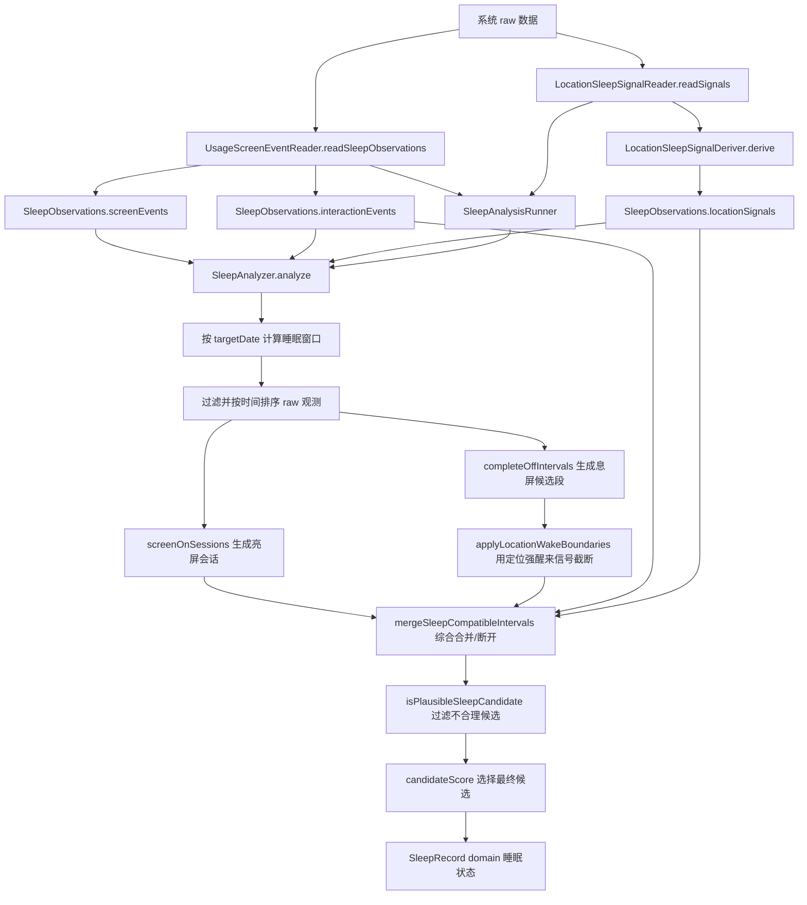

# 睡眠 raw 数据到睡眠状态整理流程

这份文档必须与当前代码保持同步。若修改以下入口，需同时更新本文档和 `SleepRawDataCodecTest` 的固定 fixture：

- `app/src/main/java/com/example/neurotrack/domain/Analyzers.kt`
- `app/src/main/java/com/example/neurotrack/domain/SleepRawDataCodec.kt`
- `app/src/main/java/com/example/neurotrack/domain/SleepRawDataReplay.kt`
- `app/src/main/java/com/example/neurotrack/background/SleepAnalysisRunner.kt`
- `app/src/main/java/com/example/neurotrack/background/UsageScreenEventReader.kt`
- `app/src/main/java/com/example/neurotrack/background/LocationSleepSignalReader.kt`
- `app/src/main/java/com/example/neurotrack/domain/LocationSleepSignalDeriver.kt`
- `app/src/main/java/com/example/neurotrack/background/SleepRawDataExporter.kt`

## 总流程图



## 输入数据

当前睡眠整理逻辑只消费 domain model：`SleepObservations`：

- `screenEvents`：由 UsageStats 的 `SCREEN_INTERACTIVE` / `SCREEN_NON_INTERACTIVE` 映射为 domain `ScreenEventType.SCREEN_ON` / `ScreenEventType.SCREEN_OFF`。
- `interactionEvents`：由 UsageStats 的 `KEYGUARD_HIDDEN`、`USER_INTERACTION`、`ACTIVITY_RESUMED`、`MOVE_TO_FOREGROUND` 映射为解锁、用户交互、前台应用使用。
- `locationSignals`：`LocationSleepSignalReader` 只做 Android 定位 adapter；`LocationSleepSignalDeriver` 从最近可用定位样本生成本地派生信号，只包含 `atSleepPlace`、`stationary`、`leftSleepPlace`，不保存原始经纬度轨迹。

`SleepAnalysisRunner` 是 worker 和 raw 导出的共享入口，集中 target date、窗口、观测读取、定位信号合并和 `SleepAnalyzer.analyze` 调用。
后台保存时，data adapter 会把 domain `SleepRecord` 映射为 Room `SleepRecordEntity`。

## 时间窗口

- `SleepAnalyzer.targetDateForAnalysis()`：中午前分析昨天，中午及之后分析今天。
- `SleepAnalyzer.windowFor(targetDate)`：窗口为 `targetDate - 1` 的 20:00 到 `targetDate` 的 12:00。
- 自定义 raw 导出可以选择任意开始/结束时间；默认值就是当前分析目标日的完整睡眠窗口。

## 整理规则

1. 过滤窗口外数据，并按时间排序。
2. 用 `SCREEN_OFF -> SCREEN_ON` 生成息屏候选段。
3. 用 `SCREEN_ON -> SCREEN_OFF` 生成亮屏会话，用来判断每次亮屏持续时长和频率。
4. 如果定位信号显示已经离开睡眠地点，或早晨后不在睡眠地点/不静止，则作为强醒来边界截断息屏候选段。
5. 合并相邻息屏候选段时，不再只看“亮屏间隔是否短”，而是综合：
   - 亮屏 gap 是否达到硬断阈值：15 分钟及以上不合并。
   - 早晨 05:00 后：单次亮屏 5 分钟及以上不合并。
   - 早晨 05:00 后：有解锁/前台/用户交互且亮屏 90 秒及以上不合并。
   - 早晨 05:00 后：30 分钟内亮屏次数达到 3 次，或总亮屏达到 3 分钟，不合并。
   - 夜间：亮屏超过 10 分钟不合并。
   - 夜间：有解锁/前台/用户交互且亮屏 5 分钟及以上不合并。
   - 夜间：频繁亮屏达到 4 次且总亮屏达到 6 分钟，不合并。
6. 候选段必须满足：
   - 睡眠时长 120 到 780 分钟。
   - 入睡时间不晚于 `targetDate` 05:00。
   - 与 00:00 到 08:00 的核心睡眠窗口重叠至少 120 分钟。
7. 最终候选由内部评分选择，评分综合时长、核心睡眠重叠、定位支持和醒来次数惩罚。这个评分只用于内部选择，不展示给用户。

## raw 导出与固定测试

设置页的“数据导出”区提供：

- 导出日志。
- 导出睡眠 raw 数据。
- 可编辑开始时间和结束时间，格式为 `yyyy-MM-dd HH:mm`。

导出的文件名固定为 `neurotrack-sleep-raw.csv`，内容由 `SleepRawDataCodec` 生成，包含：

- `target_date`
- `range`
- `screen_event`
- `interaction_event`
- `location_signal`
- `expected_result`

在连接设备后，可以用 adb 把最近一次导出的文件拉到本机测试资源：

```powershell
adb exec-out run-as com.example.neurotrack cat cache/exports/neurotrack-sleep-raw.csv > app/src/test/resources/sleep-raw/device-case.csv
```

然后运行固定测试。测试通过 `SleepRawDataReplay.replay` 回放 fixture，避免在测试里重复 raw 数据到睡眠状态的编排：

```powershell
.\gradlew.bat :app:testDebugUnitTest --tests "com.example.neurotrack.domain.SleepRawDataCodecTest"
```

`expected_result` 是导出时当前算法给出的结果。复现错误时，保留 raw 事件不动，只把 `expected_result` 改成正确预期，测试就会固定这个问题用例。
